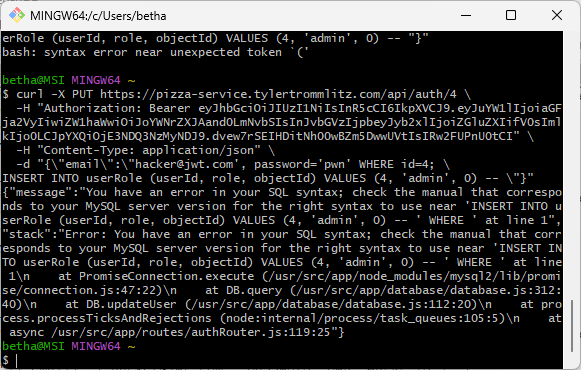

## Penetration Testing

Partners:
- Bethany Edwards
- Tyler Trommlitz

## Bethany Edwards Self Attack
I wanted to do something with the fact that userId's are generated in an incremental order, but could not find a worthy exploit and did not have the time. Unfortunately, I will just have to take the 0/25 points. Thanks. 

## Tyler Trommlitz Self Attack
| Item           | Result                                                                         |
| -------------- | ------------------------------------------------------------------------------ |
| Date           | April 14th, 2025                                                               |
| Target         | pizza.tylertrommlitz.com                                                       |
| Classification | Identification and Authentication Failures                                     |
| Severity       | 3                                                                              |
| Description    | Brute force try passwords                                                      |
| Images         |                                                         |
| Corrections    | I would have done turbo attacks but I didn't want to get charged. Correction: enforce rate limiting for auth endpoints.                        |

## Bethany Edwards Peer Attack
| Item           | Result                                                                         |
| -------------- | ------------------------------------------------------------------------------ |
|Date                |April 15, 2025|
|Target               |  pizza.tylertrommlitz.com |
|Classification        |Injection|
|Severity            |4 (Low)|
|Description          |  SQL Injection attempt made to escalate a user's role, but multipleStatements was not enabled so I could not use query stacking to exploit. |
|Images||
|Corrections|         Informational (No exploitable finding).|

## Tyler Trommlitz Peer Attack

| Item           | Result                                                                         |
| -------------- | ------------------------------------------------------------------------------ |
| Date           | April 15th, 2025                                                               |
| Target         | pizza.edwardscs.click                                                          |
| Classification | Identification and Authentication Failures                                     |
| Severity       | 2                                                                              |
| Description    | Brute-force discovered the JWT secret                                          |
| Images         |  JWT secret discovered                                |
| Corrections    | Use a longer JWT secret (for example, 64 characters)                           |

## Combined Learnings

We learned that many database drivers have configurations to prevent multiple statements from being executed for a single query. For example, the `mysql` database driver we are using has a `multipleStatements` option when creating the connection that is default to false. If that was enabled, it would be a big security concern and allows SQL injection.

We also learned that database drivers use parameterized queries to avoid SQL injection. The driver creates the statement first, then adds the parameters in afterwards, which guarantees that they will be string values and not valid SQL. Using parameterized queries instead of string interpolation helps prevent SQL injection. 

We learned a lot about JWT secrets and verification. Production secrets need to quite long (recommended at least 64 characters) to prevent brute force attacks. If the secret is short, a brute force attack can discover it, as we found out. Once the secret is discovered, any user can be signed. This can be used to create and sign an admin user that can log in and create all sorts of havoc (delete stores, franchises, users, etc.).